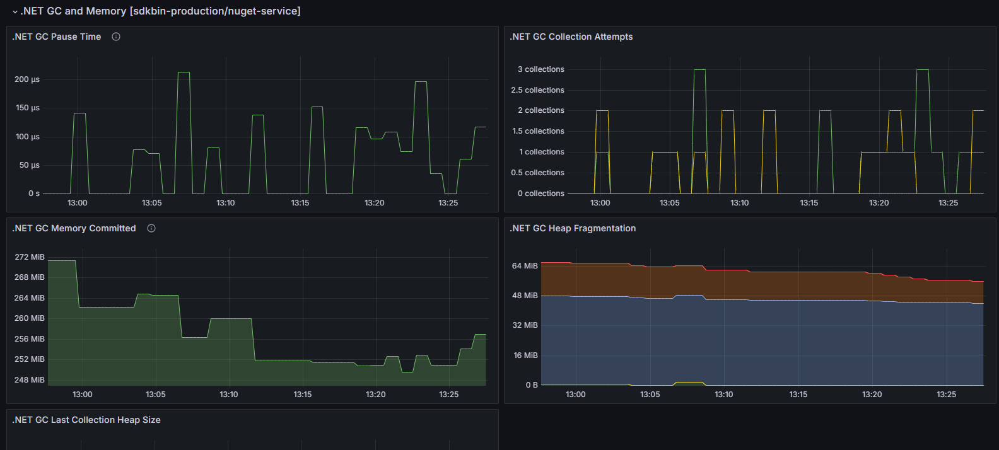
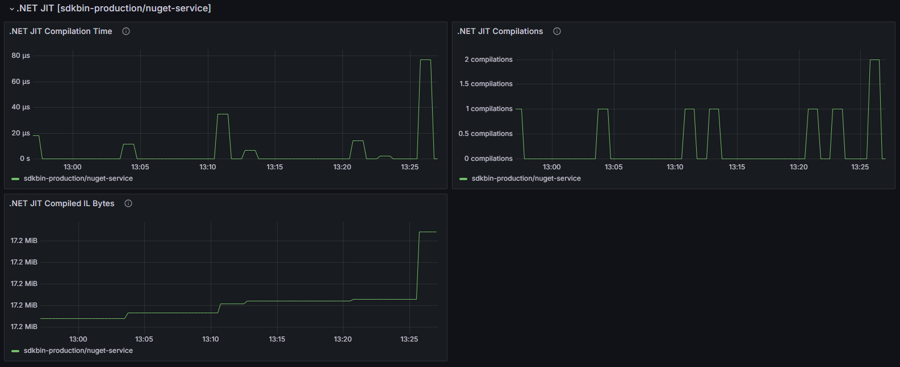

# .NET Runtime Dashboard

This Grafana dashboard provides comprehensive monitoring of .NET Core runtime metrics, giving you deep insights into your application's performance, memory management, threading, and exception handling.

## Dashboard Overview

The dashboard is divided into several key sections:

### Exceptions and Assembly Loading


### Garbage Collection Performance


### JIT Compilation Metrics


### ThreadPool and CPU Usage


## Features

- **Exception Monitoring**: Track both handled and unhandled exceptions
- **Garbage Collection**: Monitor GC performance, heap sizes, and collection frequencies
- **JIT Compilation**: Track JIT compilation times and methods
- **ThreadPool**: Monitor thread pool utilization and CPU usage
- **Assembly Loading**: Track loaded assemblies and loading times
- **Memory Usage**: Monitor detailed memory metrics across different generations

## Prerequisites

To use this dashboard, you need to have the following [`OpenTelemetry.Instrumentation.Runtime`](https://www.nuget.org/packages/OpenTelemetry.Instrumentation.Runtime) package installed in your .NET application:

```xml
<ItemGroup>
    <PackageReference Include="OpenTelemetry.Instrumentation.Runtime" Version="{version}" />
</ItemGroup>
```

This dashboard is designed to work with Prometheus and the OTLP Exporter. 

```csharp
var builder = WebApplication.CreateBuilder(args);

builder.Services.AddOpenTelemetry()
    .WithMetrics(metrics =>
    {
        metrics
            // OTHER METRICS SOURCES
            .AddRuntimeInstrumentation();
            
    })
    // traces, et al
    .UseOtlpExporter();

var app = builder.Build();
```

## Installation

1. Import the dashboard into Grafana from Grafana Cloud: [https://grafana.com/grafana/dashboards/23179](https://grafana.com/grafana/dashboards/23179)

2. Import the dashboard into Grafana as a JSON file:
   - Open Grafana
   - Navigate to Dashboards > Import
   - Click "Upload JSON file"
   - Select the [`dotnet-runtime-dashboard.json`](dotnet-runtime-dashboard.json) file
   - Select your Prometheus data source
   - Click "Import"

## Metrics Explanation

### Exception Metrics
- Total exceptions thrown
- Exception types and frequencies
- Exception rate over time

### GC Metrics
- GC collection counts by generation
- GC pause times
- Heap sizes
- Memory allocation rates

### JIT Metrics
- Methods JIT compiled
- JIT compilation times
- Assembly loading metrics

### ThreadPool Metrics
- Thread pool queue length
- Thread count
- Thread pool completion rate
- CPU usage per thread